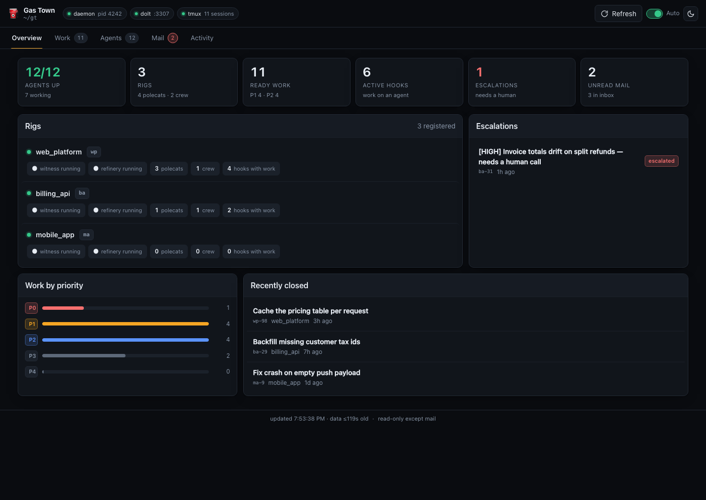
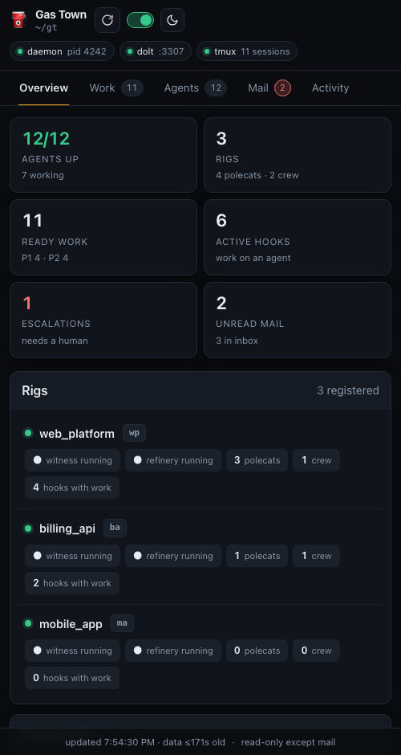
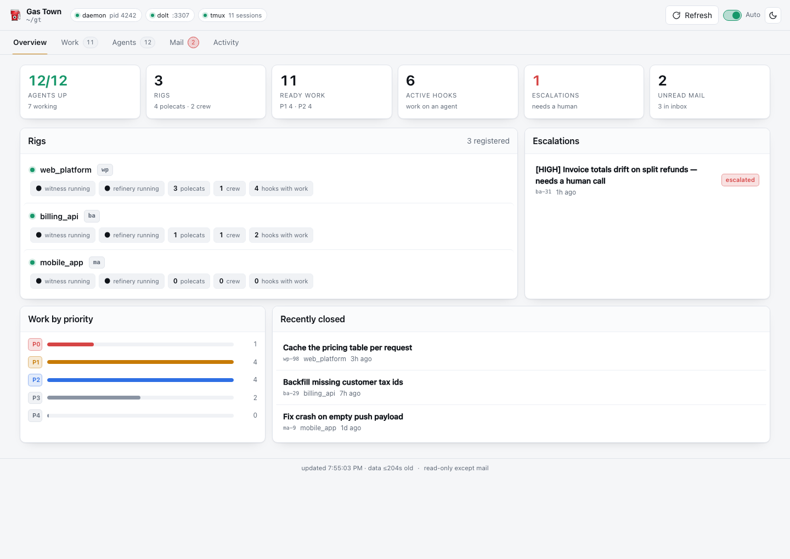

# Gas Town Console

A web admin console for [Gas Town](https://github.com/steveyegge/gastown), the multi-agent
orchestrator. One page that answers *what are my agents doing, what work is queued, and what
needs me* — on a laptop or a phone.

**NOTE: This repo is constantly updated by my town as I give feedback during use.**

Python standard library only. No npm, no pip, no build step.



## Try it in 10 seconds

Demo mode serves synthetic data and never runs `gt`, so you can look before you install
anything:

```bash
git clone https://github.com/jtmckay2017/gastown-console.git
cd gastown-console
python3 server.py --demo
# → http://localhost:8099
```

## Use it for real

```bash
./start.sh          # localhost only
```

It reads a live Gas Town workspace via the `gt` CLI. Nothing is configured — it finds your
town at `~/gt` (override with `--town`).

## What's in it

| Tab | What it shows |
|---|---|
| **Overview** | Agents up, rigs, ready work, active hooks, escalations, unread mail · rig health · priority histogram · recently closed |
| **Work** | What is in flight and who holds it; the scheduler's queue with each blocked item's blocker named, the capacity broken out and, in a sentence, why nothing is dispatching; convoy progress; and every ready issue, with live search and source/priority filters |
| **Board** | The same beads as a kanban — columns are beads' own statuses (blocked always among them), plus one derived from the agents' screens: "Being worked", because nothing in Gas Town ever writes `in_progress` and a column keyed on it stands empty while polecats work. Swimlanes are the epic hierarchy, and clicking a card opens its gathered context, proposed plan and acceptance criteria beside the board. The one place the console writes: draft a bead, revise the plan on one, link two, mail an agent to go and redraft it — and, on a console bound to your own machine, read a finished plan and approve it, which puts an agent on it |
| **Backlog** | Each rig's whole plan with its structure intact: epic trees and dependency chains drawn as SVG, what is blocked and behind what, and why every closed bead closed |
| **Agents** | Every agent in town — including the deacon's dogs and anything else holding a session — grouped by what it is actually doing, read from its screen: working, input staged, assigned, idle, done, parked, not started, stopped |
| **Mail** | Inbox, plus compose with address autocomplete and voice dictation |
| **Activity** | The `gt trail` event feed |

Dark and light themes, auto-refresh, and a layout that works on a phone.

<p align="center">
  
  
</p>

## Why it's built this way

`gt status` takes several seconds, and concurrent `gt` calls contend on the Dolt server. So
the server **never shells out on the request path**. A background scheduler refreshes each
panel on its own cadence into a cache, and HTTP always serves that cache — requests answer in
single-digit milliseconds no matter how slow the CLI is. Panels carry their own age, and a
failed refresh keeps the last good data rather than blanking the panel.

The Agents tab does not trust `gt`'s `state` field, because it means "has a bead on its hook"
rather than "is doing something" — a mayor executing tool calls for an hour reads `idle`. So
activity is derived from the agent's tmux pane instead, on the same background scheduler. That
also makes the console the first thing in the town that spots a *stranding* — a finished turn
with an answer still sitting unsent in the input box — without somebody having to go and look.

## Security

The console is **read-only except for an allowlist of writes**, and there is no shell
passthrough and no command palette:

| Write | What it runs | Where |
|---|---|---|
| `POST /api/mail` | `gt mail send` | anywhere |
| `POST /api/bead-new` | `bd create` in the rig's own beads repo | anywhere |
| `POST /api/bead-edit` | `bd update` — title, type, priority, and the four long fields | anywhere |
| `POST /api/bead-link` | `bd dep add`, or `bd update --parent` | anywhere |
| `POST /api/dispatch` | `bd comment`, then `gt sling` | **your own machine only** |

**Nothing deletes.** There is no close, no delete and no unlink.

Every edit is optimistic: the request carries what the console had, the server re-reads the
bead, and a field somebody else moved in the meantime is **rejected and shown**, never merged
and never overwritten. Agents rewrite these beads continuously, so a last-write-wins Save
would quietly drop their work.

Sending mail nudges the recipient agent awake, and Gas Town agents typically run with
permission checks disabled — so treat the compose box as "start an autonomous agent", not
"send a chat message".

### Approving a plan starts an agent

The last row of that table is different in kind from the others: `gt sling` spawns a fresh
polecat that will work the bead, write code and open a merge request. So it can merge code,
and it is fenced accordingly.

- **Your own machine only.** Bound to anything but the loopback, the endpoint does not exist
  (`404`) and the button is never drawn. Check it without trusting the page:
  `curl -s http://…/ | grep gt-dispatch` prints `content="on"` or `content="off"`, and the
  startup banner says which console you started.
- **You approve the plan you read.** The approval carries the bead exactly as it was on
  screen; if an agent has rewritten any of it in the meantime the dispatch is refused, tells
  you which field moved, and shows you what it says now.
- **The approval is on the bead before anything runs** — a `bd comment` with the time, the
  target, a sha256 of everything approved, and the plan text as it was read. If the sling then
  fails, that goes on the record too. There is no per-user login here, so it names the machine
  and the OS user rather than pretending to name a person.
- **One at a time.** A bead already approved, already on a hook, or with no plan written on it
  takes a second deliberate press with the reason on screen. There is no auto-approve, no batch
  approve, and nothing on a timer — by design, permanently.

Binding beyond localhost auto-generates a token:

```bash
./start.sh --lan     # binds 0.0.0.0, prints a URL carrying the token
```

Even so, prefer a private network overlay (Tailscale, WireGuard) over exposing this to a LAN
you don't control. The token is a speed bump, not authentication — which is exactly why the
console *drops* the dispatch write there instead of putting the token in front of it.

## Requirements

- Python 3.9+
- [Gas Town](https://github.com/steveyegge/gastown) (`gt` on your `PATH`) — except in `--demo`
- macOS or Linux

## Options

```
python3 server.py [--port 8099] [--bind 127.0.0.1] [--town ~/gt]
                  [--token TOKEN] [--no-auth] [--demo]
```

`?theme=dark` or `?theme=light` forces a theme, which is handy for a wall display.

## Not affiliated

An independent companion tool. Not affiliated with or endorsed by Gas Town or its authors. It
talks to the `gt` CLI's JSON output and contains none of Gas Town's code.

## License

MIT — see [LICENSE](LICENSE).
